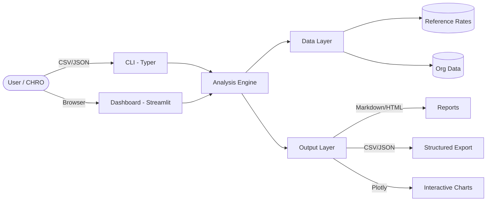
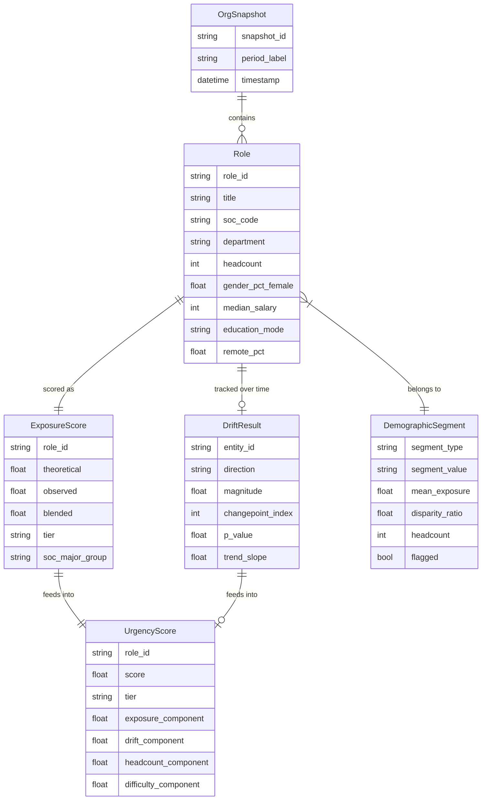

# Architecture — AI Exposure Drift Monitor

## System Context



## Data Flow

```
Raw Org Data (CSV/JSON)
    │
    ▼
┌─────────────────────┐
│  Validation          │  validators.py — schema checks, type coercion, missing field handling
│  (ingest/)           │  parser.py — CSV/JSON parsing with error collection
│                      │  onet_mapper.py — fuzzy title → SOC code mapping
└─────────┬───────────┘
          │  List[Role]
          ▼
┌─────────────────────┐
│  Exposure Engine     │  exposure.py — blended theoretical + observed index per role
│  (analysis/)         │  drift.py — CUSUM changepoint detection on time series
│                      │  demographics.py — disparity ratios by segment
│                      │  reskill.py — composite urgency scoring
└─────────┬───────────┘
          │  ExposureScore, DriftResult, UrgencyScore
          ▼
┌─────────────────────┐
│  Output Layer        │  charts.py — Plotly/matplotlib visualizations
│  (output/)           │  report.py — Markdown + HTML report assembly
│                      │  export.py — structured data export
└─────────────────────┘
```

## Key Components

### Ingestion Layer (`src/aedm/ingest/`)

**`validators.py`** — Validates incoming data against expected schemas. Checks for required columns, valid data types, and value ranges. Returns structured error lists rather than raising on first failure, so users get all validation issues at once.

**`parser.py`** — Handles CSV and JSON ingestion. Applies validators, coerces types where safe (e.g., string headcount to int), and produces a list of validated `Role` objects. Supports both single-snapshot and multi-period (quarterly) data loading.

**`onet_mapper.py`** — Maps free-text job titles to SOC codes using a combination of exact match lookup and fuzzy matching via `thefuzz`. Users can provide SOC codes directly to bypass mapping. Confidence scores are attached to fuzzy matches.

### Analysis Layer (`src/aedm/analysis/`)

**`exposure.py`** — The core computation engine. For each role, looks up its SOC major group in the reference rates, then computes a blended exposure index: `0.4 * theoretical + 0.6 * observed`. Observed exposure is weighted more heavily because it reflects what AI is actually doing, not just what it could theoretically do. All scores are normalized to [0, 1].

**`drift.py`** — Detects changes in exposure trends over time using CUSUM (cumulative sum control chart) changepoint detection. Given a time series of exposure scores for a role or department, it identifies the point at which the trend shifts and assesses significance via permutation testing. Also provides simple linear trend estimation with confidence intervals.

**`demographics.py`** — Segments the workforce by gender, education level, and pay band, then computes exposure-weighted headcount for each segment. Calculates disparity ratios (segment mean exposure / org-wide mean exposure) and flags segments where the ratio exceeds 1.2x. This operationalizes Anthropic's finding that AI exposure disproportionately affects female, more educated, and higher-paid workers.

**`reskill.py`** — Computes a composite urgency score for each role: `0.3 * exposure_level + 0.25 * drift_velocity + 0.25 * headcount_at_risk + 0.2 * reskill_difficulty`. Reskill difficulty is estimated as the skill-space distance between the current SOC and the nearest lower-exposure SOC. Scores are normalized to [0, 1] and assigned to tiers: Critical (>0.75), High (>0.5), Moderate (>0.25), Low.

### Output Layer (`src/aedm/output/`)

**`charts.py`** — Generates all visualizations using Plotly for interactive output and matplotlib for static PNG fallback. Chart types include exposure heatmaps, drift sparklines, demographic disparity bars, and urgency scatter matrices. Uses the project color palette: deep navy (#1B2A4A), teal (#2EC4B6), warm amber (#FF6B35), soft gray (#E8E8E8), alert red (#E63946).

**`report.py`** — Assembles Markdown and HTML reports combining narrative text, data tables, and embedded charts. Reports are structured for a CHRO audience: executive summary first, then departmental breakdown, then detailed role-level data.

**`export.py`** — Exports all computed metrics (exposure scores, drift results, urgency rankings) as structured CSV or JSON for integration with downstream systems (HRIS, BI tools).

### Interface Layer

**`cli.py`** — Typer-based CLI with four commands: `aedm analyze` (single-snapshot analysis), `aedm drift` (multi-period drift detection), `aedm report` (generate report artifacts), and `aedm dashboard` (launch Streamlit app). Uses Rich for terminal formatting.

**`dashboard/app.py`** — Streamlit application with six tabs: Org Overview, Exposure Heatmap, Drift Analysis, Demographics, Reskilling Priority, and Scenario Modeling. Supports filtering by department, exposure tier, and time period.

## Data Model



## Extension Points

- **Alternative exposure models:** Implement a new function matching the `compute_exposure_index` signature and swap it in via config. The blended weighting is configurable.
- **Additional data sources:** The parser layer accepts any CSV/JSON conforming to the schema. Add new parsers for HRIS-specific formats (Workday, BambooHR) by extending `parser.py`.
- **Custom scoring functions:** The urgency score weights are configurable via `UrgencyWeights`. Provide your own weights or replace the scoring function entirely.
- **New demographic dimensions:** Add segments to `DemographicSegment` (e.g., tenure, location) by extending the enum and updating `demographics.py`.
- **Additional chart types:** Add new chart functions to `charts.py` following the existing pattern of returning both Plotly figure and optional PNG bytes.

## Design Rationale

| Decision | Choice | Rationale |
|----------|--------|-----------|
| Statistical methods over ML | CUSUM, permutation tests, composite scoring | Interpretability matters for CHRO audience. Black-box models undermine trust in workforce decisions. |
| Pydantic over dataclasses | Pydantic v2 | Built-in validation, serialization, and settings management. Data integrity is critical for workforce analytics. |
| Typer over argparse | Typer | Type-hint-driven CLI with automatic help generation. Less boilerplate, better developer experience. |
| Plotly over alternatives | Plotly + matplotlib fallback | Interactive charts for dashboards, static export for reports. Single library covers both use cases. |
| Observed > theoretical weighting | 60/40 blend | Theoretical exposure measures what AI *could* do; observed measures what it *is* doing. Operational decisions should weight reality more heavily. |
| SOC major group granularity | 2-digit SOC codes | Matches Anthropic's published data granularity. Finer-grained mapping requires O\*NET task-level data not yet publicly available at the observed-exposure level. |
