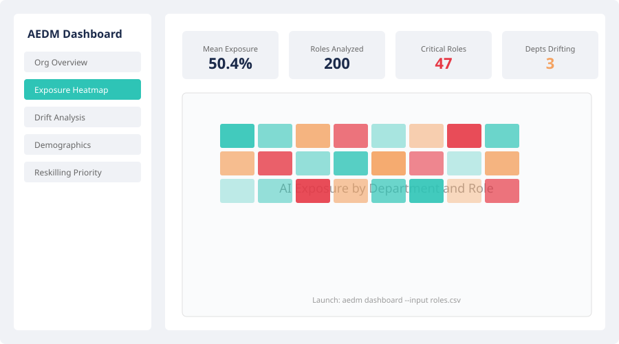

# AI Exposure Drift Monitor (AEDM)

**Measurement-first AI workforce intelligence. From research paper to operational tool.**

[](https://aedm.streamlit.app)
[](https://github.com/ahwrist/ai-exposure-drift-monitor/actions/workflows/ci.yml)
[](https://www.python.org/downloads/)
[](LICENSE)
[](https://github.com/astral-sh/ruff)

Operationalizes Anthropic's AI labor market exposure framework into a workforce planning tool.

---

## The Research Question

> **At the organizational level, how is the gap between theoretical AI capability and actual adoption distributed across roles, departments, and demographic segments — and how can organizations detect when that gap is closing before displacement becomes visible?**

Massenkoff & McCrory's March 2026 paper, *"Labor Market Impacts of AI: A New Measure and Early Evidence,"* establishes the macro-level framework: theoretical AI exposure (what LLMs *could* do, per Eloundou et al.'s beta ratings of O\*NET tasks) far exceeds observed adoption (what organizations are *actually* automating, measured via the Anthropic Economic Index). Across all 22 SOC major groups, 97% of observed Claude tasks fall into categories rated as theoretically feasible — yet actual coverage remains far below theoretical ceilings.

But the paper explicitly leaves open the organizational question. Economy-wide rates tell a CHRO nothing about *their* workforce. The paper's demographic findings — that top-exposure-quartile workers are 16 percentage points more female, 11pp more white, nearly 2x more likely Asian, hold graduate degrees at 17.4% vs. 4.5%, and earn 47% more — describe macro patterns that may or may not hold within any given organization. And crucially, there is no longitudinal tracking: the paper provides a snapshot, not a trajectory.

AEDM fills that gap. It operationalizes the Massenkoff & McCrory framework at the organizational level, adding the temporal and equity dimensions the original research calls for but does not provide.

## The Solution

AEDM takes the theoretical + observed exposure framework from Anthropic's research and operationalizes it for your specific organization. Point it at a CSV of your job roles and get back:



- **Exposure scores** per role, department, and org-wide
- **Drift detection** showing where exposure is accelerating
- **Demographic disparity analysis** identifying disproportionate impact
- **Reskilling urgency rankings** to prioritize investment

```bash
# Analyze your workforce
$ aedm analyze --input roles.csv --output report/

# Launch interactive dashboard
$ aedm dashboard --input roles.csv
```

## What AEDM Adds Beyond the Paper

AEDM makes four contributions that extend the original research into operational territory:

1. **Macro → Organizational translation.** The paper provides economy-wide exposure rates by SOC code. AEDM maps your specific roles to that framework, revealing how *your* workforce — not the national average — is positioned relative to AI capability.

2. **Snapshot → Temporal tracking.** The paper is cross-sectional. AEDM adds a longitudinal dimension via CUSUM changepoint detection and linear trend analysis on quarterly exposure data, surfacing *drift* — are your exposure rates accelerating, decelerating, or stable?

3. **Aggregate → Equity lens.** The paper shows macro-level demographic skew. AEDM applies the same analysis within your organization, testing whether your specific role mix replicates or departs from economy-wide patterns of disproportionate exposure by gender, education, and pay band.

4. **Measurement → Action.** The paper measures; AEDM prescribes. Composite urgency scoring connects exposure measurement to workforce strategy by weighting exposure level, drift velocity, headcount at risk, and reskilling difficulty.

## Key Findings (Sample Data)

Running AEDM against a synthetic 200-role organization reveals patterns consistent with Massenkoff & McCrory's macro findings: ~50% mean blended exposure with a substantial theoretical-observed gap, exposure concentrated in IT, Engineering, and R&D departments, and disproportionate impact on higher-educated and higher-paid segments. The drift analysis across four quarterly snapshots identifies departments where exposure is statistically accelerating — precisely the early-warning signal the original research framework is designed to enable but does not itself provide.

These patterns illustrate the tool's analytical value: macro research establishes *that* AI exposure is unevenly distributed; AEDM shows *where* and *how fast* within a specific organization.

## Quick Start

```bash
# Install
pip install aedm

# Run analysis on your org data
aedm analyze --input your_roles.csv --output report/

# Or use the sample data to explore
aedm analyze --input data/sample/acme_corp_roles.csv --output report/

# Launch the interactive dashboard
aedm dashboard --input your_roles.csv
```

See [docs/quickstart.md](docs/quickstart.md) for a full 5-minute walkthrough.

## Features

- **Exposure indexing** — Blended theoretical + observed AI exposure scores by role, department, and org-wide
- **Temporal drift detection** — CUSUM changepoint detection with permutation-based significance testing
- **Demographic disparity analysis** — Exposure breakdown by gender, education, and pay band with disparity flagging
- **Reskilling urgency scoring** — Composite score accounting for exposure, drift velocity, headcount, and reskill difficulty
- **Interactive dashboard** — Streamlit app with filters, drill-down, and scenario modeling
- **Report generation** — Markdown and HTML reports with embedded Plotly charts
- **Structured export** — CSV/JSON export of all computed metrics

## Methodology

AEDM's analysis pipeline is built on peer-reviewed methods adapted from Anthropic's exposure framework:

- **Exposure Index:** Weighted composite of theoretical exposure (from O\*NET task inventories) and observed exposure (calibrated against Anthropic's published rates). Observed exposure is weighted more heavily (60/40) because it reflects actual adoption, not just feasibility.
- **Drift Detection:** CUSUM (cumulative sum control chart) changepoint detection identifies when exposure trends shift. Significance is assessed via permutation testing.
- **Disparity Analysis:** Exposure-weighted headcount by demographic segment, with disparity ratios flagged when a segment exceeds 1.2x the org-wide mean.
- **Urgency Scoring:** Composite of exposure level (30%), drift velocity (25%), headcount at risk (25%), and reskill difficulty (20%).

For full statistical details, see [docs/methodology.md](docs/methodology.md).

## Data Requirements

**Minimum input:** A CSV with a `title` column containing job titles.

**Full schema for richer analysis:**

| Column | Type | Required | Description |
|--------|------|----------|-------------|
| `role_id` | string | No | Unique role identifier |
| `title` | string | **Yes** | Job title |
| `soc_code` | string | No | O\*NET SOC code (auto-mapped if absent) |
| `department` | string | No | Department name |
| `headcount` | integer | No | Number of people in role (default: 1) |
| `gender_pct_female` | float | No | Proportion female (0-1) |
| `median_salary` | integer | No | Median salary |
| `education_mode` | string | No | Most common education level |
| `remote_pct` | float | No | Proportion remote-eligible (0-1) |

## Architecture

AEDM follows a layered pipeline architecture: ingestion, analysis, and output.

```
Org Data (CSV/JSON) → Validation → SOC Mapping → Exposure Engine
                                                       ↓
                              Dashboard ← Report ← Drift/Demographics/Urgency
```

See [ARCHITECTURE.md](ARCHITECTURE.md) for the full system design.

## Research Context

This tool is positioned within a growing body of AI labor market research:

- **Massenkoff & McCrory (2026)** — "Labor Market Impacts of AI: A New Measure and Early Evidence." Anthropic. Introduces the theoretical vs. observed exposure framework and the Anthropic Economic Index.
- **Brynjolfsson, Chandar & Chen (2025)** — Combined AI task-level exposure measures with ADP employment data to estimate labor market effects.
- **Acemoglu et al. (2022)** — "AI and Jobs: Evidence from Online Vacancies." Analyzed the relationship between AI exposure and job posting trends.
- **World Economic Forum (2025)** — Future of Jobs Report. Found 63% of employers cite skills gaps as the primary barrier to AI-driven transformation.

AEDM operationalizes these research findings so organizations can move from "AI will reshape the workforce" to "here is exactly where, how fast, and what to do about it."

## Development Philosophy

This project was built using **CLAUDE.md-driven agentic development** with Claude Code:

- **Strict build-order convention** — A phased build sequence in CLAUDE.md ensures reproducible agent execution from a single prompt
- **Agent memory pattern** — AGENT_LOG.md tracks decisions across sessions for continuity
- **Statistical rigor over ML complexity** — CUSUM, permutation tests, and composite scoring rather than black-box models
- **Measurement-first design** — Every output is designed to be presented to a CHRO, not just a data scientist

## Author

**Andrew Wrist** — [GitHub](https://github.com/ahwrist)

## Contributing

Contributions are welcome. See [CONTRIBUTING.md](CONTRIBUTING.md) for development setup, code style expectations, and PR process.

## License

MIT License. See [LICENSE](LICENSE) for details.
